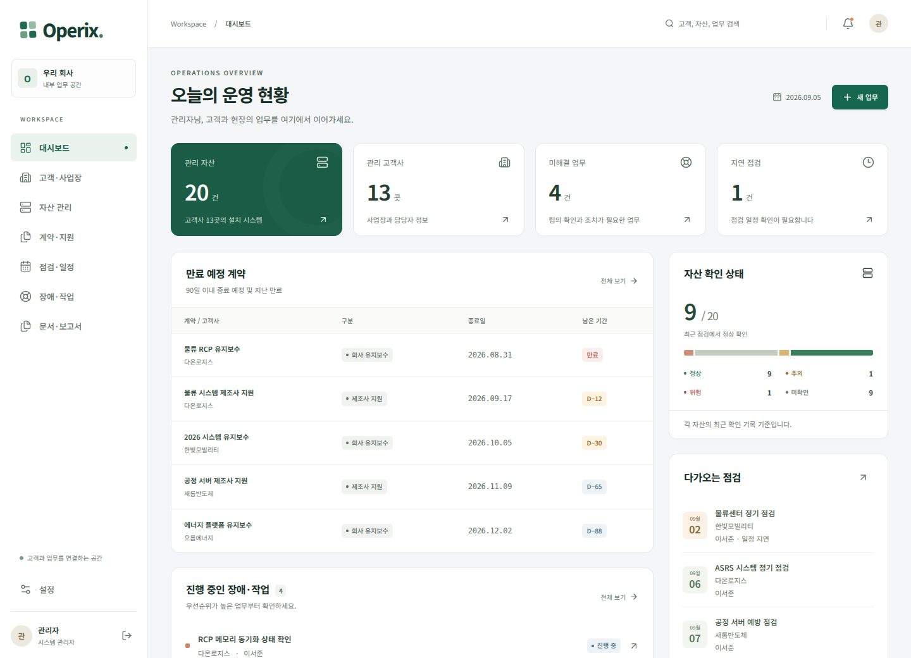

# Operix

고객사, 설치 자산, 계약과 현장 업무를 연결하는 사내 ERP입니다.

[](https://github.com/happyaspic-byte/Operix/actions/workflows/ci.yml)



## 첫 버전 기능

- 고객사·사업장·담당자 관리.
- 시스템 자산, everRun 노드·Endurance 구성요소, VM과 사양 관리.
- 회사 유지보수·제조사 지원·제품 사용권 구분, 여러 자산 연결, 갱신 상태.
- 반복 점검 생성, 체크리스트·결과·후속 조치, 담당자 배정.
- 장애·작업 접수, 조치 이력, 관찰 사실·내부 추정·제조사 확인 구분.
- 비공개 첨부 파일, 확정 시점이 보존되는 보고서, 인쇄·PDF 저장.
- XLSX·CSV 내보내기, 가져오기 매핑·검증·중복 방지·일괄 반영.
- 관리자·업무 관리자·기술지원·영업·조회 전용 역할, 서버 권한 검사.
- 로그인 세션 회수, 변경 이력, 동시 수정 충돌 감지, 앱 내부 알림.

공개 저장소의 예제·화면·테스트에는 가상 자료만 사용합니다. 운영 자격증명과 실제 고객 자료는 저장소에 포함하지 않습니다.

## 사내 Ubuntu 설치

[설치·업데이트·백업·복구 가이드](docs/DEPLOYMENT.md)를 따르세요.

```bash
cp .env.example .env
# 실제 접속 주소와 관리자·DB 비밀번호·세션 키를 설정하세요.
docker compose up --build -d
```

PostgreSQL이 준비되면 스키마와 최초 관리자 계정을 생성한 뒤 웹과 일정 처리기가 실행됩니다. 운영에서는 SEED_DEMO=0을 사용합니다. 외부 접속은 사내 HTTPS 프록시와 승인된 VPN 구성을 이용합니다.

## 로컬 개발·검증

Node.js 24 권장. Docker 없이 확인할 때만 PGlite를 명시적으로 활성화합니다.

```bash
npm ci
npm run setup:local
npm run db:migrate
npm run db:seed
npm run dev
```

로컬 계정은 admin@operix.test이며 비밀번호는 setup:local이 무작위로 생성해 .env의 ADMIN_PASSWORD에 저장합니다. 운영 계정에는 이 로컬 설정을 재사용하지 마세요.

```bash
npm test
npm run build
npx playwright install chromium
E2E_START_SERVER=1 npm run test:e2e
```

단위·DB 검증은 기본적으로 별도 메모리 DB를 사용합니다. TEST_DATABASE_URL이 있으면 해당 별도 PostgreSQL DB를 이용합니다. GitHub Actions는 실제 PostgreSQL 17, Chromium, DB·첨부 파일 복구 및 Docker 컨테이너 기동을 검사합니다.

## 문서

- [개발 계획](docs/PLAN.md)
- [검증 결과와 평가](docs/VERIFICATION.md)
- [다른 ERP와의 비교](docs/COMPARISON.md)
- [설치와 운영](docs/DEPLOYMENT.md)

현재 버전은 고객·자산·유지보수 범위입니다. 영업·구매·재고·재무·인사는 후속 확장 대상입니다. 실제 사내 자료 이관, 운영망·인증서 구성과 현장 복구 시험은 해당 환경에서 진행해야 합니다.
